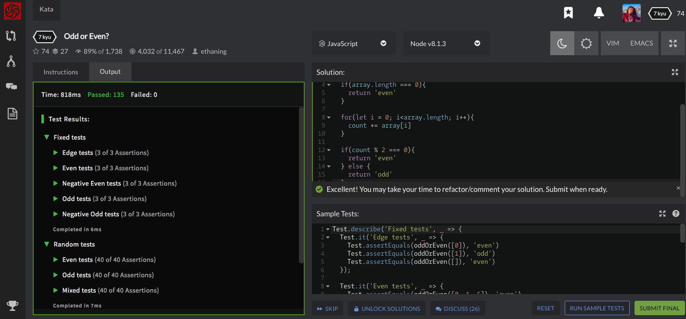

//7 kyu
//Odd or Even?

// Given an array of numbers (a list in groovy), determine whether the sum of all of the numbers is odd or even.

// Give your answer in string format as 'odd' or 'even'.

// If the input array is empty consider it as: [0] (array with a zero).

