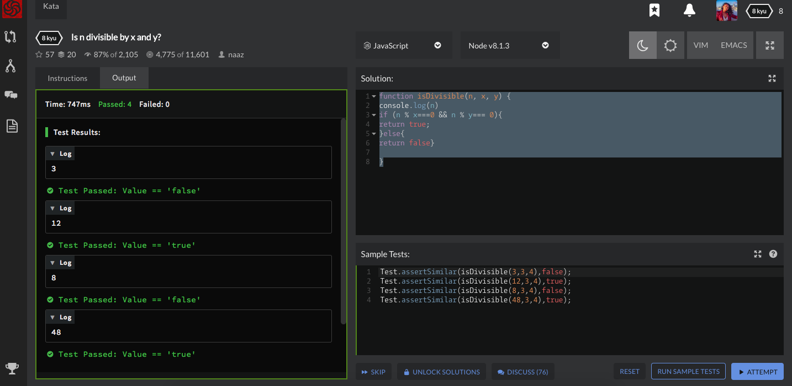

isDivisible Function

Create a function isDivisible(n, x, y) that checks if a number n is divisible by two numbers x AND y. All inputs are positive, non-zero digits.

How It's Made:
Tech used: JavaScript

Optimizations:

I could have solved the problem without adding the "return". 

